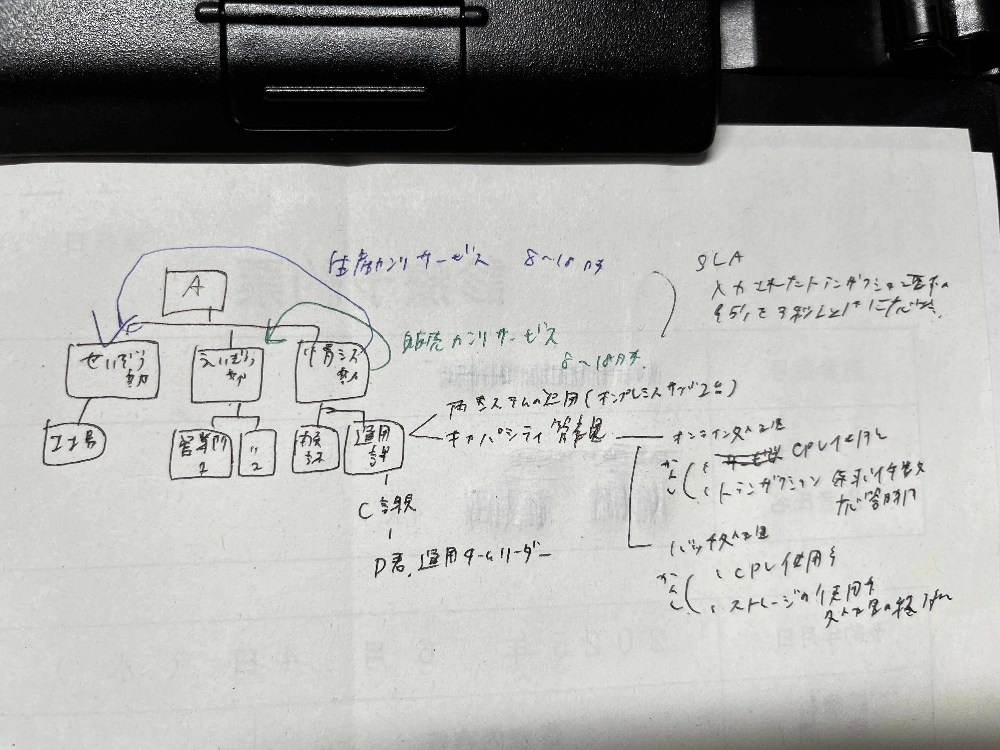

# 📅2025-07-08（火）

## 今日やったこと
#### 午後問題
- R7年春期問10：サービスマネジメント（過去問道場より）  
・・選択問題の選定、掴みのため、 1日1分野やっていく予定  
昨年と同一の問題は出ないらしいけど掴みだから...

    - こんな感じで書きながら解いた
    

    - 採点結果
    

## 所感や学んだこと
- 午後問題が全くの初めてだった割りには意外と解けている（感動）  
・・この問題がたまたま簡単だった気もするが
- サービスマネジメントの選択アリだな

## 疑問や調べたこと
- 午後問題.サービスマネジメントはどんな問題が出題されるのか？（何をおさえておけばいい？）
    - 参考になりそうなもの
    - https://www.sikaku-no-iroha.co.jp/it-qualification/ap/servicemanagement-ap
    - https://masassiah.web.fc2.com/contents/20ap/note15.html
    - ITILの知識→ITILの本読もう
    - https://gihyo.jp/article/2023/11/quick-start-itil-4-textbook

## 次回やること
#### 午前問題
- 技術書の勉強で代替（learning-logの方に記録）
#### 午後問題
- R7年春期次の問題（分野）